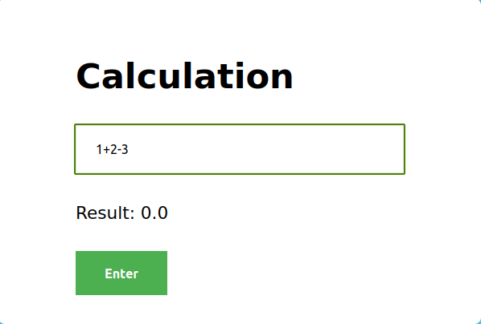

# SimpleConsoleCalculator

### Тестовое задание на позицию Java/Kotlin разработчика в компанию Byndyusoft
В качестве тестового задания предлагаем написать на Java или Kotlin консольный калькулятор (можно с веб-интерфейсом),  
который принимает входную строку, содержащую математическое выражение (целые и десятично-дробные числа, знаки +, -, *, / и скобки)   и выводит в консоль результат его вычисления. Задание предполагает самостоятельную реализацию парсинга и расчета математического выражения. 
Главным критерием при оценке задания является использование при разработке TDD и принципов SOLID.   
Архитектура решения должна обеспечивать расширение списка поддерживаемых операций при минимальном и максимально безболезненном для существующей функциональности внесении изменений в исходный код. Код должен быть легко читаем и отформатирован в едином стиле, содержать минимальное число поясняющих комментариев.

### Пример консольного ввода:
    Введите выражение: 1+2-3
    Результат: 0
    Примеры с унарным минусом (добавлено для дополнительного пояснения):
    -3+2
    2*(3)
    2-(3)

Результатом будет публично доступный репозиторий на GitHub с исходным кодом тестового задания.

### Перечень вариантов для запуска:
##### 1. Установка на ПК.
    1.1. Для начала, необходимо клонировать репозиторий. Далее нужно убедится, что установлно следующее:
    - JDK 20 или старше
    - Gradle 8.2 или старше
    - IDE для запуска (можно пропустить если запускать через CLI)
    1.2. Запустить можно через IDE, Makefile (уже создан), через CLI (gradle tasks)
##### 2. Docker
    2.1. Клонировать репозиторий
    2.2. Запустить (предворительно настроить порты)
### Деплой
Приложение развернуто по этому адресу https://simple-calculate.onrender.com/
